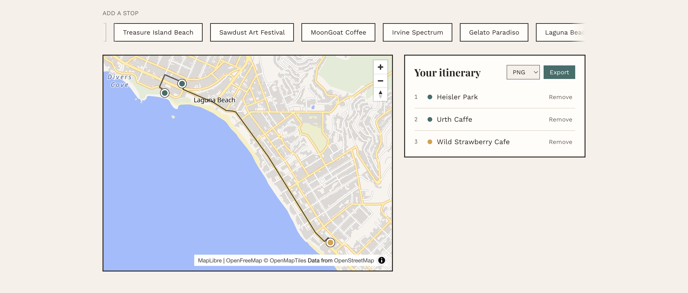
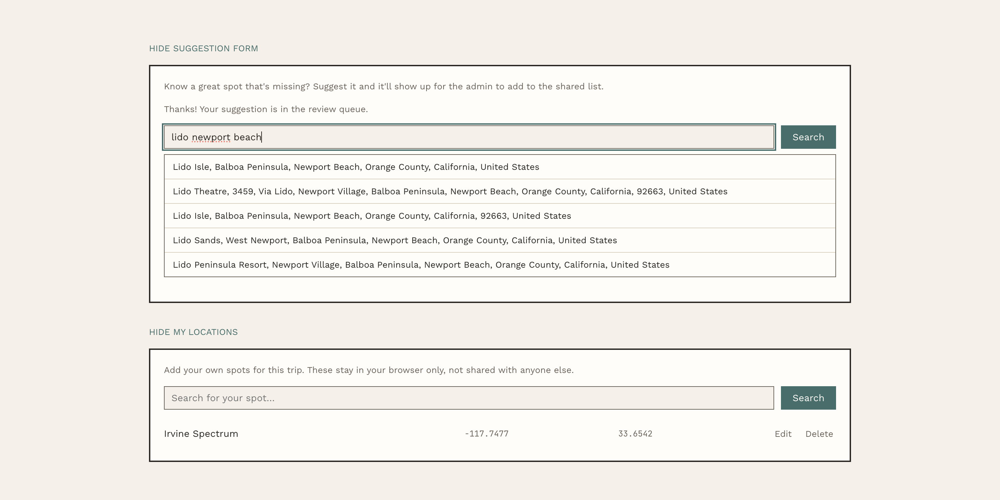
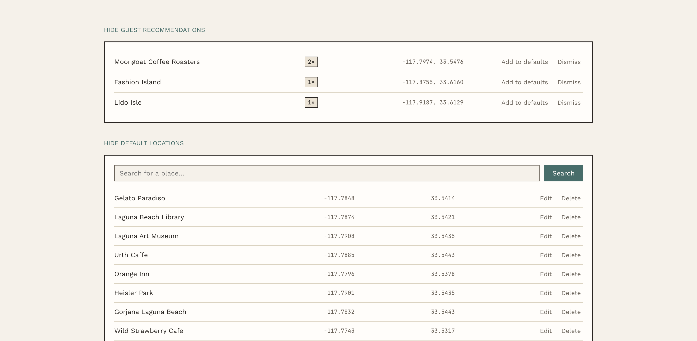
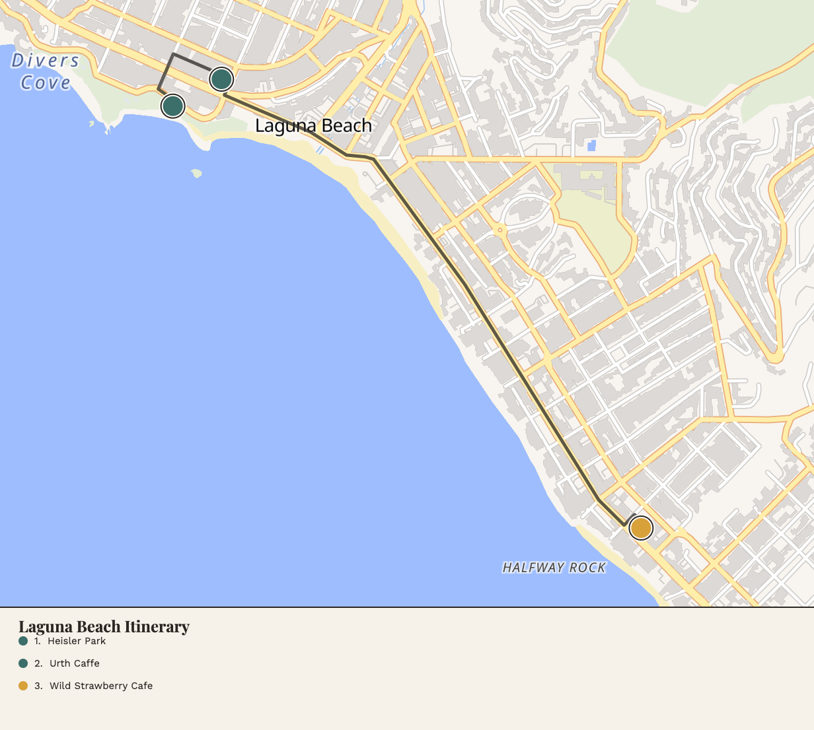

# maplibre-app

this project is a react app i created to practice javascript, css, and working with the open-source maplibre library.

# day trip: laguna beach

recently, i went on a day trip with some friends to laguna beach and i remembered stressing out the few nights before planning what i wanted to do there. taking inspiration from that experience, i thought it would be fun to create a map-based application that has a list of recommended places to visit and itinerary list a user can add to.

# screenshots

**guest view:** choose locations from the default pins suggested, get your own day-trip route!



**guest view:** is your favorite location not listed? suggest a pin (sent to admin for review) or use the personal-pin feature to add your own private pin



**admin view:** the admin can review guest recommendations and choose to add them to the default pin list. they can also remove default pins if locations have been reported to be closed.



**exported itinerary:** done using the app? export your itinerary as a png, jpeg, or pdf!



# tech stack

- **frontend**: react (create react app), plain css
- **map**: maplibre gl js, styled with openfreemap's free vector tiles
- **routing**: osrm's public demo server, for a real street-following route between stops
- **geocoding**: openstreetmap's nominatim, so places can be added by name instead of typing coordinates
- **backend**: express, with sqlite (node's built-in `node:sqlite`) for storage
- **deployment**: the react app on vercel, the api on render

# running locally

the location data lives in a small sqlite-backed api server instead of a hardcoded file, so two things need to run at once:

```
# terminal 1: api server (first time only, run: cd server && npm install)
cd server && npm start

# terminal 2: react app
npm start
```

the react dev server proxies `/api/*` requests to the api server on port 4000.

# admin access

admin view is gated by a passcode, checked server-side. it isn't a real user account, but is enough to keep guests from adding, editing, or deleting the default locations. (set `ADMIN_KEY` in the environment; it defaults to `laguna-admin`.)

# deploying

vercel only serves the static react build, so it can't run the api server: there's no persistent disk for the sqlite file and no long-running process. the api needs to run somewhere else, and the deployed frontend needs to be told where to find it.

**1. deploy the api to render (free tier):**
- push this repo to github (already done if you're reading this on github)
- on [render.com](https://render.com), choose New > Blueprint and connect this repo. it reads `render.yaml` at the repo root and configures the service automatically (root dir `server`, `npm install` / `npm start`, node >=22.5 for `node:sqlite`)
- optionally set an `ADMIN_KEY` value in the render dashboard instead of using the `laguna-admin` default
- once deployed, copy the service url, for example `https://maplibre-app-api.onrender.com`

note: render's free plan doesn't persist disk across redeploys, so the sqlite file (and anything added through the app) resets to the seed locations whenever the api is redeployed. it does survive normal idling and spin-down/spin-up between requests, just not a fresh deploy.

**2. point the deployed frontend at it:**
- on vercel, go to project settings > environment variables and add `REACT_APP_API_BASE` set to your render url plus `/api`, for example `https://maplibre-app-api.onrender.com/api`
- redeploy the vercel project so the build picks up the new environment variable

locally, `REACT_APP_API_BASE` is left unset and defaults to the relative `/api` path, which cra's dev-server proxy already forwards to `http://localhost:4000`, so no change is needed for local dev.